# Web App automatically deployed to Aws

A simple web application was created in order to deploy it in 3 differen ec2 instances.

## Description of the aws-script-create.sh file

Running the file will do the following:
- Create the folder ```/build``` where will be the web application content.
- Create a key pair on AWS and dowload the key pair .pem in your local machine.
- Create the security group on AWS.
- Add the appropriate permissions for the security group.
- Create 3 ec2 instances on AWS.
- Copy the ```/build``` folder to each instance.
- Install npm and run the web application in each instance.
- You can access to 3 different urls to the web application.

> In the console will be showed the urls to access to the web application.

> ⚠️ **If you want to delete the instances, security group and key pair you have to write *delete* after the execution when the message is showed**: Be very careful here!

## How to deploy it on AWS:

- First you have to clone this repository in your local machine.
- You have to configure your AWS account in your local machine with the command ```aws configure ```.
- Finally you have to execute the next script ```./aws-script-create.sh ``` in order to create the instances and deploy the wep application on AWS.

## Example doing the exercise:

### The repository must be in our local machine:

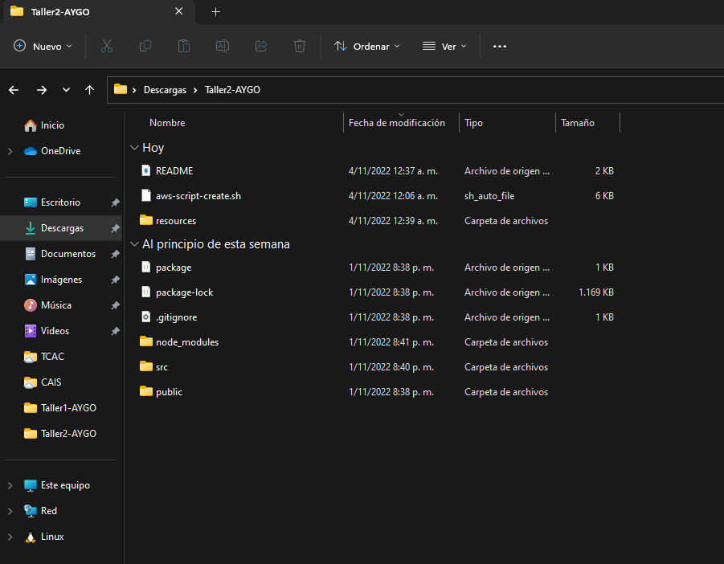

### AWS configuration must be done:

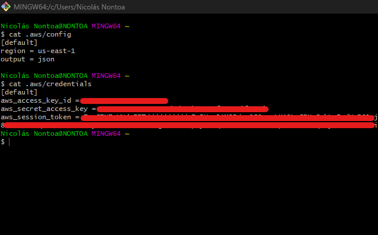

### Execute the script:

- ### The script starts creating the build folder, the key pairs, the security group and the permissions associated:

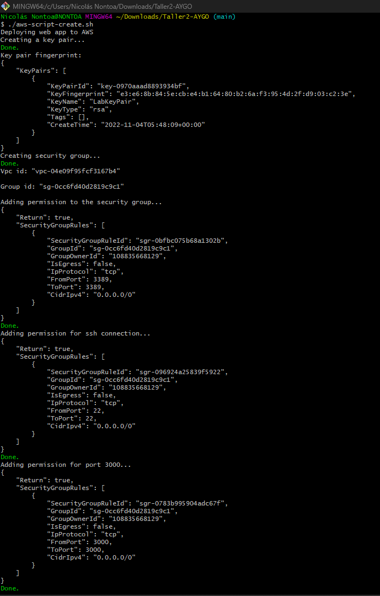

- ### Then create the 3 ec2 instances and copy the build folder to each instance:

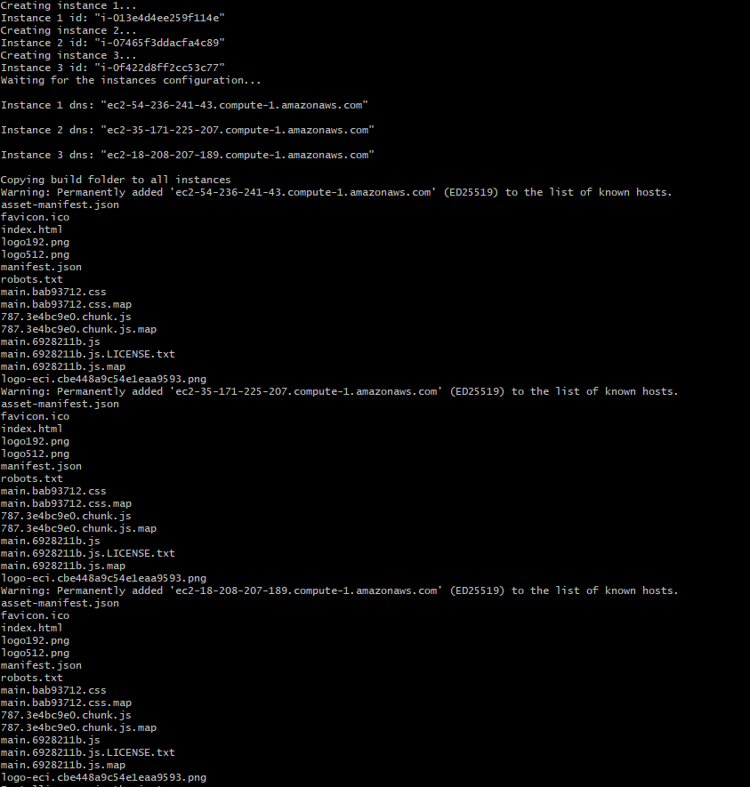

- ### Then install npm in each instance:
    
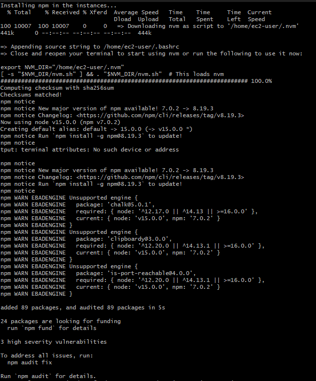

- ### Finally run the web application in each instance:

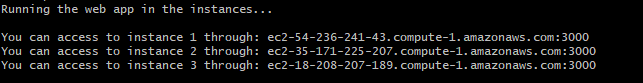

- ### We can open the url's and see the web application:

### First URL:

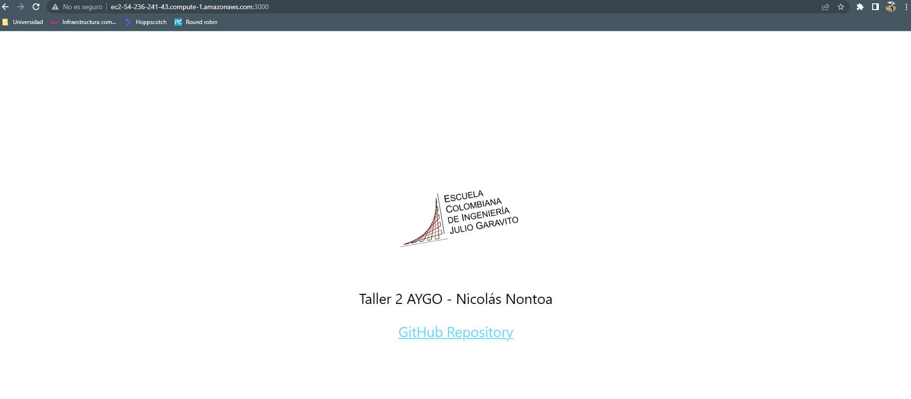

### Second URL:

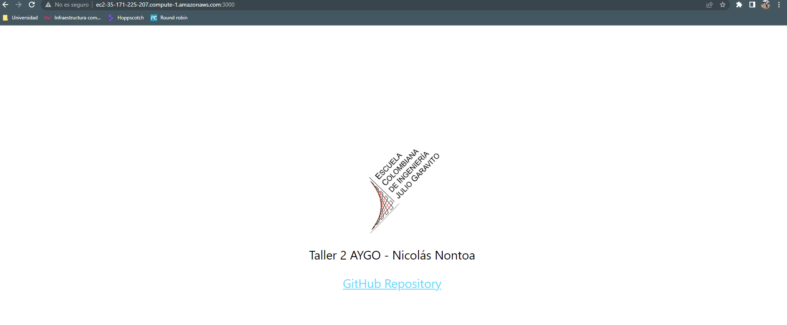

### Third URL:

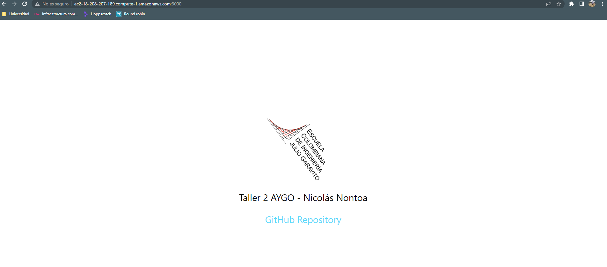

- ### Also we can see in the AWS console that the instances, security group and key pair were created:

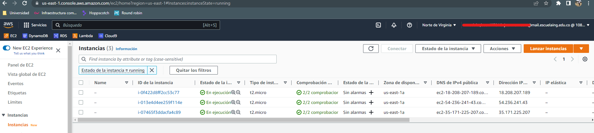
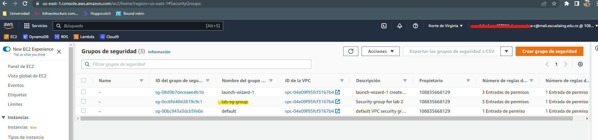
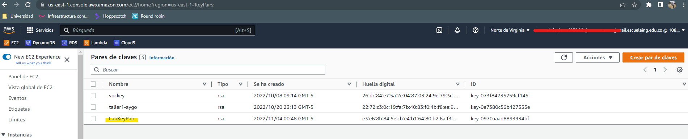

- ### At the end we can write delete to remove the instances, security group and key pairs that were created previously:

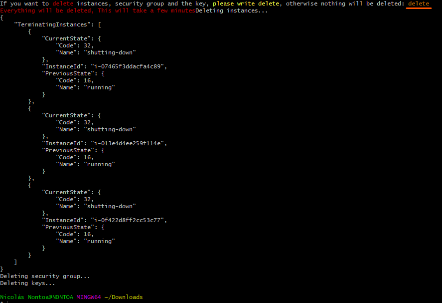